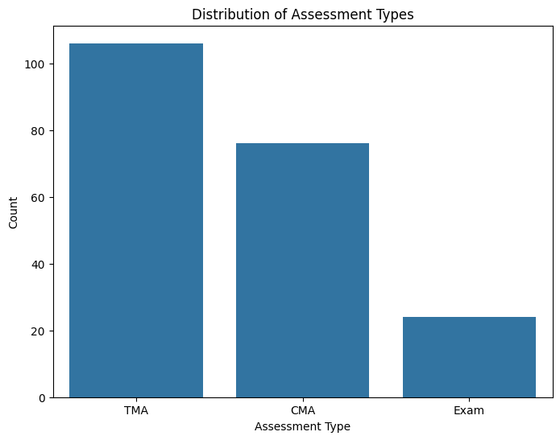

```python
import pandas as pd
import matplotlib.pyplot as plt
import seaborn as sns
import sys
import os

sys.path.append(os.path.abspath("../../../../../../Downloads"))
from SQL.database import DatabaseConnection
from EDA.visualizations import Visualizations
from tqdm.notebook import tqdm

db = DatabaseConnection()
db.connect()    
```

    ✓ Conexión exitosa a MySQL con SQLAlchemy


    True


```python
# Obtener datos para análisis (ejemplo)
queries = [
    ("student_info", "SELECT * FROM student_info"),
    ("student_registration", "SELECT * FROM student_registration"),
    ("student_vle", "SELECT * FROM student_vle"),
    ("assessments", "SELECT * FROM assessments"),
    ("student_assessment", "SELECT * FROM student_assessment"),
]

dataframes = {}

for name, query in tqdm(queries, desc="Cargando tablas desde MySQL", unit="tabla"):
    print(f"Cargando: {name}")
    dataframes[name] = pd.read_sql(query, db.connection)

# Extraer
student_info = dataframes["student_info"]
student_registration = dataframes["student_registration"]
student_vle = dataframes["student_vle"]
assessments = dataframes["assessments"]
student_assessment = dataframes["student_assessment"]
```


    Cargando tablas desde MySQL:   0%|          | 0/5 [00:00<?, ?tabla/s]


    Cargando: student_info
    Cargando: student_registration
    Cargando: student_vle
    Cargando: assessments
    Cargando: student_assessment


```python
# --- Analisis Student Info ---
confusion_matrix = pd.crosstab(student_info['gender'], student_info['final_result'])
Visualizations.plot_confusion_matrix(confusion_matrix)
"""
Muestra una matriz de confusión entre género y resultado final.
Útil para detectar posibles brechas de género en el rendimiento académico.
"""
```


    

    


    '\nMuestra una matriz de confusión entre género y resultado final.\nÚtil para detectar posibles brechas de género en el rendimiento académico.\n'


```python
numeric_cols = ['num_of_prev_attempts', 'studied_credits']
corr_matrix = student_info[numeric_cols].corr()
Visualizations.plot_correlation_matrix(corr_matrix)
"""
Muestra una matriz de correlación entre variables numéricas.
Útil para descubrir relaciones lineales entre variables como intentos previos y créditos estudiados.
"""
```


    

    


    '\nMuestra una matriz de correlación entre variables numéricas.\nÚtil para descubrir relaciones lineales entre variables como intentos previos y créditos estudiados.\n'


```python
Visualizations.plot_boxplot(student_info, 'num_of_prev_attempts', 'final_result')
"""
Muestra un boxplot de una variable numérica segmentada por una variable categórica.
Útil para visualizar la distribución, la mediana y los outliers en diferentes grupos.
"""    
```


    

    


    '\nMuestra un boxplot de una variable numérica segmentada por una variable categórica.\nÚtil para visualizar la distribución, la mediana y los outliers en diferentes grupos.\n'


```python
Visualizations.plot_histogram(student_info, 'studied_credits')
"""
Muestra un histograma de una variable numérica.
Útil para comprender la distribución de la variable (asimetría, sesgo, normalidad).
""" 
```


    

    


    '\nMuestra un histograma de una variable numérica.\nÚtil para comprender la distribución de la variable (asimetría, sesgo, normalidad).\n'


```python
Visualizations.plot_scatter(student_info, 'num_of_prev_attempts', 'studied_credits')
"""
Muestra un scatter plot (diagrama de dispersión) entre dos variables numéricas.
Útil para detectar patrones, correlaciones o relaciones no lineales entre variables.
"""
```


    

    


    '\nMuestra un scatter plot (diagrama de dispersión) entre dos variables numéricas.\nÚtil para detectar patrones, correlaciones o relaciones no lineales entre variables.\n'


```python
# Segmentación sociodemográfica
Visualizations.plot_boxplot(student_info, 'studied_credits', 'age_band')
```


    

    


```python
Visualizations.plot_boxplot(student_info, 'studied_credits', 'imd_band')
```


    

    


```python
# --- Analisis Student Registration ---
Visualizations.plot_registration_status_distribution(student_registration)
"""
Muestra la distribución de las puntuaciones obtenidas en los assessments.
Útil para analizar el rendimiento de los estudiantes en las diferentes evaluaciones.
"""
```


    

    


    '\nMuestra la distribución de las puntuaciones obtenidas en los assessments.\nÚtil para analizar el rendimiento de los estudiantes en las diferentes evaluaciones.\n'


```python
# --- Analisis Assessments ---
Visualizations.plot_assessment_type_distribution(assessments)
```


    

    


```python
# --- Analisis Student Assessment ---
Visualizations.plot_assessment_score_distribution(student_assessment)
```


    

    


```python
db.disconnect()
```


```python

```


```python

```
